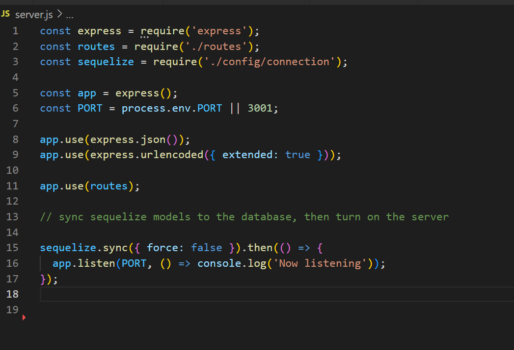

# internet-retail-therapy

This is a README file for the Internet Retail Therapy application, completed by Joe Cosentino

## Important Links

* main repository link: https://github.com/JoeCosentino/internet-retail-therapy
* walk-through video link: 
    1. Part One: https://drive.google.com/file/d/1bVCwo5cwitPxttSFRna-gj25DDEcD0r9/view
    2. Part Two: https://drive.google.com/file/d/1aEDBs8YxHpMZ18Dt6SRKQ37dOQOfWqbT/view

## To Download

* you can download these files to your local computer using either:
    1. SSH: git@github.com:JoeCosentino/internet-retail-therapy.git
    2. HTTPS: https://github.com/JoeCosentino/internet-retail-therapy.git

## Collaboraters

* Giuseppe (Joe) Cosentino
    - main developer on project
* Just Tech News, Module 13
    - allowed for framework to be referenced and certain elements and code to be analysed.
* W3Schools
    - assisted in explaining certain HTML and CSS functions
* AskBCS
    - Provided much assistance and clarification during development of this application

## Screenshot of Assignment

## Licensing

MIT License

Copyright (c) 2022 JoeCosentino

Permission is hereby granted, free of charge, to any person obtaining a copy
of this software and associated documentation files (the "Software"), to deal
in the Software without restriction, including without limitation the rights
to use, copy, modify, merge, publish, distribute, sublicense, and/or sell
copies of the Software, and to permit persons to whom the Software is
furnished to do so, subject to the following conditions:

The above copyright notice and this permission notice shall be included in all
copies or substantial portions of the Software.

THE SOFTWARE IS PROVIDED "AS IS", WITHOUT WARRANTY OF ANY KIND, EXPRESS OR
IMPLIED, INCLUDING BUT NOT LIMITED TO THE WARRANTIES OF MERCHANTABILITY,
FITNESS FOR A PARTICULAR PURPOSE AND NONINFRINGEMENT. IN NO EVENT SHALL THE
AUTHORS OR COPYRIGHT HOLDERS BE LIABLE FOR ANY CLAIM, DAMAGES OR OTHER
LIABILITY, WHETHER IN AN ACTION OF CONTRACT, TORT OR OTHERWISE, ARISING FROM,
OUT OF OR IN CONNECTION WITH THE SOFTWARE OR THE USE OR OTHER DEALINGS IN THE
SOFTWARE.
